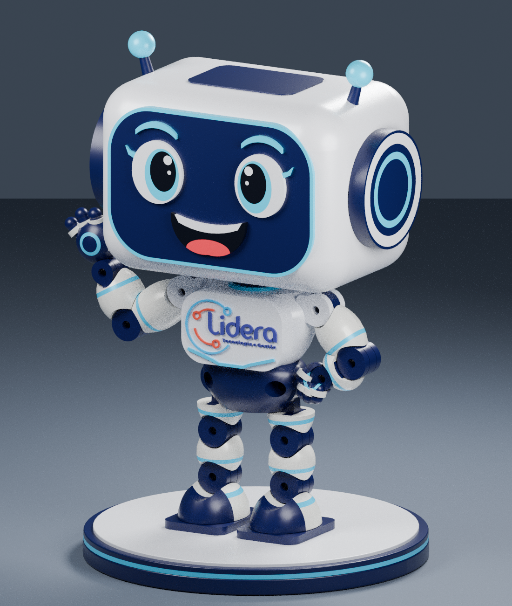
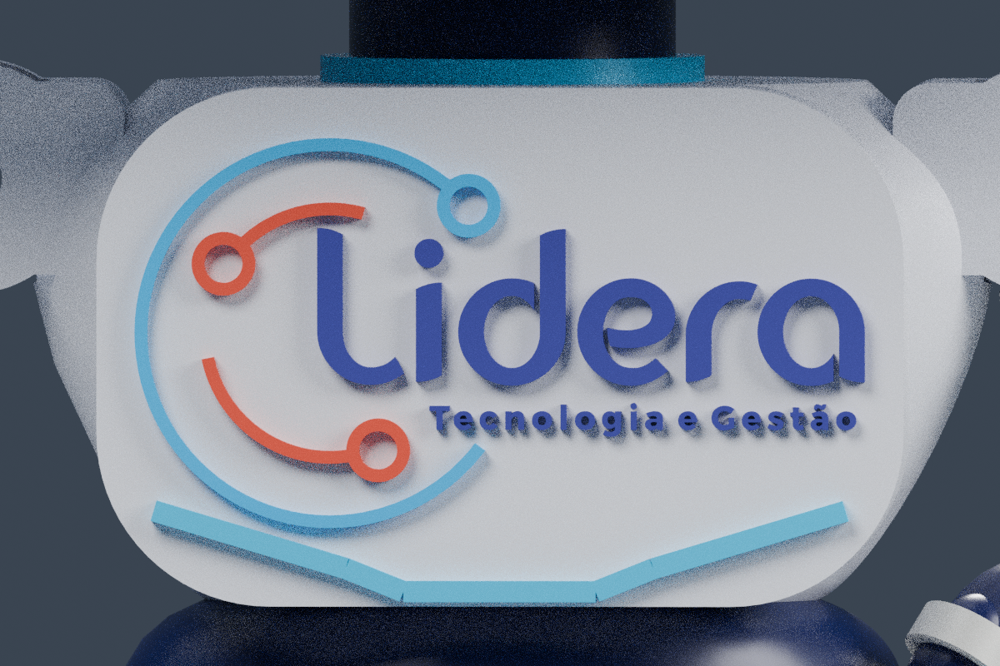

# Boneco Lidera — protótipo articulado de 180 mm

Reconstrução CAD da ilustração fornecida, destinada à Bambu Lab A1 e à impressão de peças separadas por cor. O boneco tem 180 mm sem a base; a base mede Ø126 × 11 mm, dando 191 mm ao conjunto.

O STEP é uma montagem com corpos sólidos nomeados e cores. As peças são separadas, e os pivôs têm furos e linguetas reais. STEP não armazena aqui uma simulação cinemática: aplique juntas no seu CAD se quiser simular movimentos. A montagem mostrada é uma pose de referência.

## Downloads

- [Baixar STEP — montagem CAD](https://github.com/brunoandersonlidera/Impress-o3d/raw/refs/heads/main/exports/Lidera_articulado_180mm.step)
- [Baixar ZIP — STLs, cupons, fontes e guia](https://github.com/brunoandersonlidera/Impress-o3d/raw/refs/heads/main/exports/Lidera_A1_180mm.zip)
- [Decalque da marca oficial — PDF em escala real](exports/decal_logo_escala_real.pdf)
- [Notas de impressão e montagem](cad/PRINT_NOTES.md)

Se o download direto exigir acesso, abra [o ZIP no GitHub](exports/Lidera_A1_180mm.zip) e use **Download raw file**. Em um repositório privado, entre na conta com acesso ao projeto.



## Arquivos

- `exports/Lidera_articulado_180mm.step`: montagem principal em milímetros.
- `exports/STL/`: peças individuais, colocadas sobre Z=0 e centralizadas em XY; orientações iniciais para fatiamento.
- `exports/cupons/`: prova de furos Ø3,2/3,3/3,4 e prova de lingueta 4,8 / vão 5,4 mm.
- `exports/Lidera_preview.png`: renderização da geometria CAD entregue.
- `exports/pecas.json`: nomes, cores, volumes e notas por componente.
- `exports/validacao.json`: resultados de integridade e reimportação do STEP.
- `exports/validacao_STL.json`: fechamento das malhas e dimensões de cada STL.
- `exports/validacao_logo.json`: volumes comparados às áreas vetoriais e apoio da marca na face do peito.
- `exports/decal_logo_escala_real.pdf`: decalques da marca; imprimir a 100%.
- `exports/logo_peito_38mm.svg`: marca oficial com tamanho físico de 38 × 20,30 mm.
- `exports/logo_peito_detalhe.png`: vista ampliada do relevo no peito, renderizada a partir do CAD.
- `assets/logo_lidera_vetor01.svg`: arquivo vetorial original fornecido, sem alterações.
- `cad/`: fontes CadQuery que geram a montagem e os arquivos.
- `cad/PRINT_NOTES.md`: detalhes de impressão, limites e montagem.

## Impressão na A1

Use PLA ou PLA+ para as carenagens, azul-marinho, branco e ciano; rosa/coral para a língua; na marca oficial, violeta-azulado, ciano e coral. A pupila pode usar o mesmo azul bem escuro. Não é necessário AMS Lite. Comece com bico 0,4 mm, camada 0,16 mm no corpo e 0,12 mm no rosto. Use 4 paredes, aumentando para 5–6 nas estruturas dos pivôs. Preenchimento inicial: 15–20% no corpo e 30–50% nas estruturas, conforme o material e os modificadores do fatiador.

Imprima primeiro os cupons. O furo nominal M3 é Ø3,3 mm; a folga lateral nominal é 0,3 mm por lado. Essas dimensões precisam de calibração na sua impressora. Não escale os STLs no Bambu Studio para mudar a altura: isso também altera furos e encaixes.

Importe as peças separadamente e organize placas por cor. Examine cada orientação no fatiador: algumas conchas precisam de suporte, e a posição sobre a mesa é uma sugestão, não um perfil Bambu Studio validado. Os STLs têm unidades implícitas; interprete como mm. Não use o STEP como uma peça única para imprimir com as articulações já montadas.

Há peças pequenas de rosto, dedos e letras. A marca do peito agora usa os contornos Bézier do SVG oficial fornecido, com proporção preservada e largura de 38 mm. O texto “Lidera”, o subtítulo e os três elementos do símbolo são corpos separados no STEP e nos STLs; o relevo tem 0,70 mm, ou 0,55 mm no subtítulo. O texto principal mede aproximadamente 8,20 mm de altura; o subtítulo completo, 1,76 mm. Para conservar os traços finos na A1 com bico 0,4 mm, prefira o decalque vetorial completo sobre o peito branco. Ao usar decalque, deixe de instalar os cinco componentes `logo_*` em relevo.

O PDF e o SVG de 38 mm preservam os degradês da arte original. As peças 3D utilizam tons sólidos: texto violeta-azulado `#3F4096`, símbolo ciano `#0BB5F3` e coral `#E74E3B`. A escolha do filamento aproxima essas cores. As curvas da marca não foram substituídas por outra fonte ou engrossadas para impressão.



## Articulações e ferragens

São 13 pivôs: pescoço; dois ombros, cotovelos, punhos, quadris, joelhos e tornozelos. O pescoço gira em Z. As outras juntas têm eixo Y e movimento no plano XZ. Os dedos são fixos e as carenagens de cor são coladas às estruturas; elas não são outras articulações.

Como lista de compra inicial, reserve 13 parafusos M3 e 13 porcas, com arruelas. Nos 12 pivôs dos membros o pacote nominal do encaixe é 11,4 mm: M3 × 20 mm é um ponto de partida com arruelas e porca. Os quadris possuem acesso rebaixado para a cabeça e a porca. Para o pescoço, M3 × 16 mm é uma estimativa inicial. Confira os comprimentos antes de apertar; a porca precisa engatar sem o parafuso atingir outra parede.

1. Teste cupons e encaixes a seco. Remova suportes e rebarbas sem danificar as faces móveis.
2. Coloque a porca no alojamento interno do casco da cabeça ainda aberto.
3. Introduza o parafuso do pescoço pelo acesso inferior do torso, antes de unir torso e pelve. Monte os colares e fixe a cabeça, deixando rotação livre.
4. Monte as linguetas nos clevis dos ombros e quadris; continue pelos cotovelos/punhos e joelhos/tornozelos. Aperte o mínimo para manter a pose.
5. Cole as capas por cor ao redor das estruturas. A cola não deve alcançar os pivôs.
6. Feche os cascos da cabeça, instale o visor e os detalhes do rosto, depois orelhas, painéis e antenas. Cole partes decorativas, preservando o acesso necessário à manutenção.
7. Monte as quatro camadas da base. Os pés apoiam livremente nela; se quiser fixação permanente para exposição, cole somente as solas à base depois de verificar a pose.

## Limites da entrega

A imagem não fornece cotas, superfícies ocultas nem mecanismos internos. Esta é uma interpretação visual com uma proposta de articulações, não uma réplica dimensional certificada. Não houve impressão física, ensaio de resistência nem teste de amplitude completa. A validação CAD verifica sólidos e a pose montada; o cupom e a montagem a seco continuam necessários. Não force movimentos bloqueados pelo corpo ou pelas carenagens.

O arquivo `exports/movimento_local.json` registra amostras digitais de dez juntas contra o componente imediatamente anterior. Não houve interferência local nas amostras de abertura de 20° dos cotovelos; de ±20° no punho esquerdo e −20°/+5° no direito; de 10° para fora nos quadris; e de ±10° nos joelhos e tornozelos. Algumas amostras no sentido oposto colidem com carenagens. Esses testes não avaliam o trajeto contínuo nem o movimento contra o boneco inteiro ou a base. Os furos dos ombros e do pescoço estão desobstruídos no CAD, mas essas juntas não receberam esse ensaio angular.

## Regenerar

O modelo foi gerado com Python 3.12, CadQuery 2.7.0 e as versões em `requirements.txt`. A renderização usa Blender 4.3.2. O texto explicativo do PDF usa DejaVu Sans em `/usr/share/fonts/truetype/dejavu/DejaVuSans.ttf`; as letras da marca são curvas vetoriais do arquivo em `assets/`, sem dependência de fonte instalada. O fluxo foi testado em Linux.

Após clonar este repositório, instale as dependências em um ambiente virtual. Comandos executados na raiz do projeto:

```sh
python3 -m venv .venv
. .venv/bin/activate
python3 -m pip install -r requirements.txt
export XDG_CACHE_HOME="$PWD/.cache"
python3 cad/build.py
python3 cad/check_stl.py
python3 cad/decal.py
blender --background --threads 4 --python cad/render.py
python3 cad/package.py
```

Use o checkout existente; não é necessário criar worktrees. Os scripts resolvem a raiz pela localização do próprio arquivo e geram os resultados em `exports/`. As malhas STEP/STL incluídas já foram geradas e validadas; não é preciso executar os scripts para baixá-las ou imprimir as peças.
